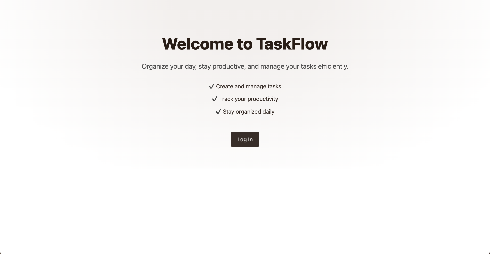
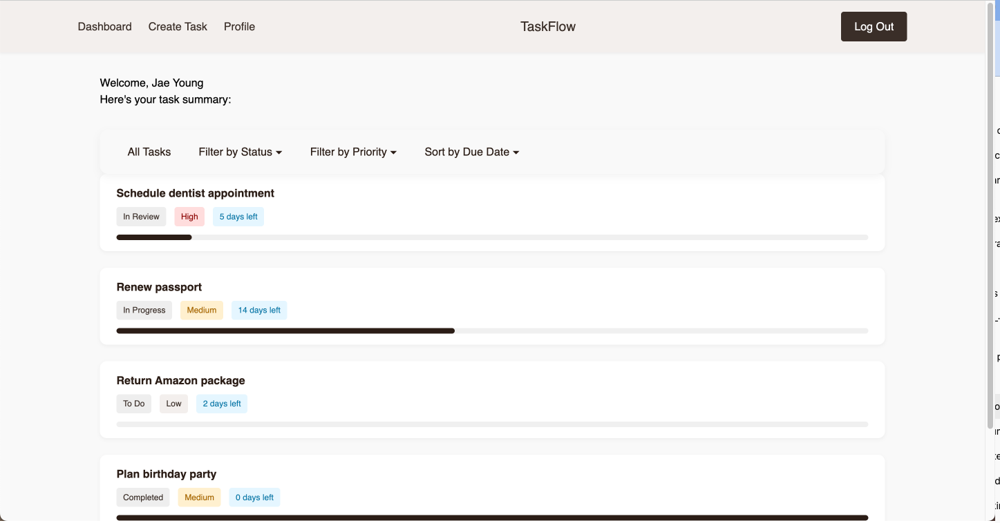

# Task Manager

A clean, type-safe task management web app built with **React + TypeScript + Auth0**.




---

## Features

- Auth0 login + registration with type-safe user data
- View, create, edit, delete tasks
- Sort by due date (asc/desc)
- Filter by status or priority
- Confirmation modal before deleting tasks
- Toast notifications for all task actions
- Empty state UI when no tasks exist
- Pagination (4 tasks per page)
- Modular component architecture
- Context API for global state with typed hooks
- Form validation and error handling with TypeScript

---

## Tech Stack

| Category         | Tools                          |
| ---------------- | ------------------------------ |
| Framework        | React (with Vite)              |
| Language         | TypeScript                     |
| Authentication   | Auth0                          |
| State Management | Context API + Hooks            |
| Styling          | Custom CSS with Espresso Theme |
| Feedback         | react-toastify                 |
| Validation       | Manual                         |

---

## Setup Instructions

###1. Clone the Repo

```bash
git clone https://github.com/your-username/task-manager.git
cd task-manager
```

### 2. Install Dependencies

```bash
npm install
```

### 3. Configure Auth0

Create a `.env` file:

```env
VITE_AUTH0_DOMAIN=your-auth0-domain
VITE_AUTH0_CLIENT_ID=your-client-id
VITE_AUTH0_CALLBACK_URL=http://localhost:5173/callback
```

> Replace the values with your own from your Auth0 dashboard.

### 4. Start the Dev Server

```bash
npm run dev
```

The app will run at `http://localhost:5173`.

---

## Architecture Overview

### File Structure

```
src/
├── components/
│   ├── dashboard/
│   │   ├── FilterBar.tsx
│   │   ├── TaskCard.tsx
│   │   ├── TaskList.tsx
│   │   └── PaginationControls.tsx
│   ├── taskmodal/
│   │   └── TaskModal.tsx
│   └── common/
│       └── ConfirmModal.tsx
├── context/
│   ├── TaskProvider.tsx
│   └── UserProvider.tsx
├── hooks/
│   ├── useTasks.ts
│   └── useUser.ts
├── mock/
│   └── tasks.ts
├── pages/
│   ├── DashboardPage.tsx
│   ├── TaskCreatePage.tsx
│   └── CallbackPage.tsx
├── types/
│   └── Task.ts
├── App.tsx
└── main.tsx
```

---

## Implementation Details

### Toast Notifications

Using [`react-toastify`](https://fkhadra.github.io/react-toastify):

```tsx
toast.success("Task created!");
toast.info("Task deleted.");
toast.success("Task updated!");
```

---

### Auth0 Integration

- `UserProvider` wraps the app
- Logged-in user is typed via `useUser()` hook
- Routes like `/dashboard` are protected via `<AuthenticationGuard />`

---

### TypeScript Highlights

```ts
type TaskStatus = "To Do" | "In Progress" | "In Review" | "Completed";
type TaskPriority = "Low" | "Medium" | "High";

interface Task {
  id: string;
  title: string;
  description: string;
  status: TaskStatus;
  priority: TaskPriority;
  dueDate: string;
  percentComplete: number;
}
```

---

## Validation & Error Handling

- Task creation requires `title`, `description`, and `dueDate`
- Inline validation with toast or inline feedback

---

## Limitations

Currently, this project does **not** include a backend. All tasks are stored in memory using mock data. This means:

- Tasks and user state are **not persisted**
- On browser refresh, tasks reset to `mockTasks.ts` content
- CRUD operations work during a session but will not persist beyond reload

## Enhancements to Consider

| Feature              | Description                             |
| -------------------- | --------------------------------------- |
| LocalStorage sync    | Persist tasks between sessions          |
| Mobile optimizations | Improve layout on small screens         |
| Drag & drop sorting  | Reorder tasks manually                  |
| Search bar           | Find tasks by title/description         |
| useFilteredTasks     | Extract filter logic into a custom hook |
| Dark mode            | Toggle via CSS variables or context     |

---
